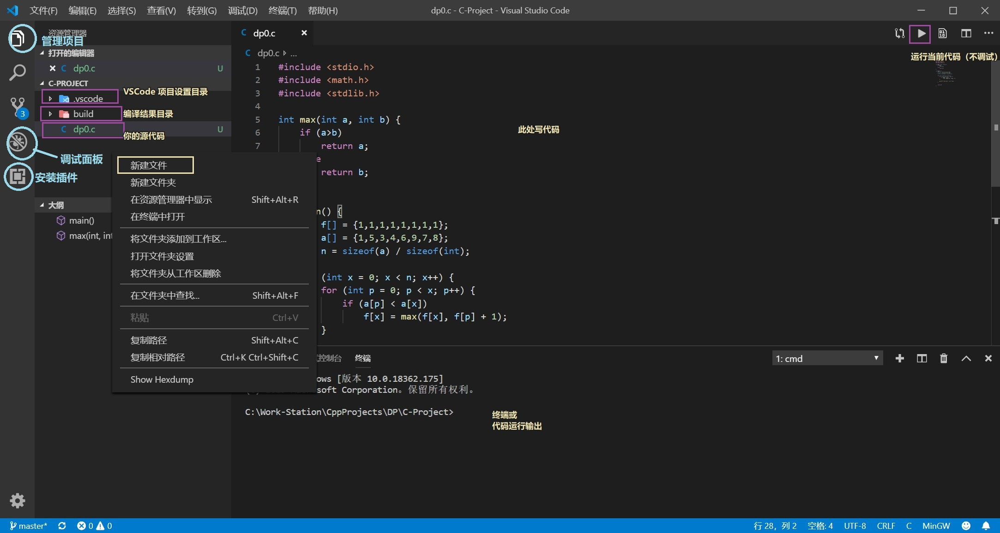
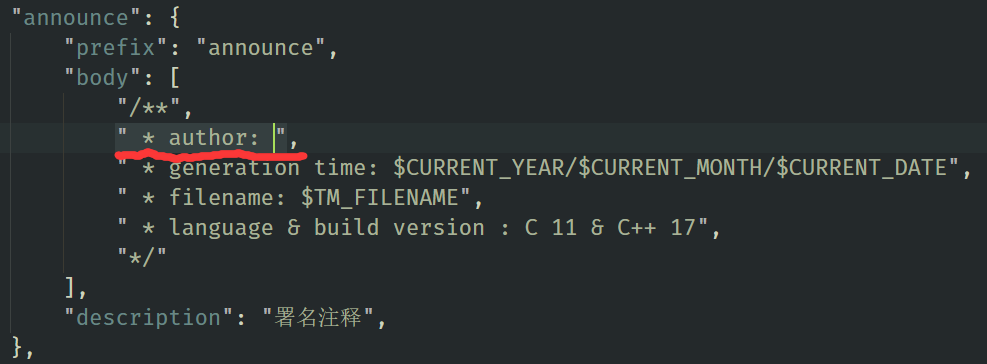

# VSCode-C-Environment ( Linux 版 )

适用于 Linux 操作系统

针对 Android 实验室成员 C 或 C++ 语言练习的 VSCode C(C++) 语言环境一键配置。仅适用于 Linux 系统。

> 与 Windows 版本的区别：
> * 默认 UTF-8 编码
> * 暂时只支持 C++ ，但是也可以编译调试 C 语言

**更新环境时请*不要*覆盖`c.code-snippets`文件！覆盖除此文件以外的其他所有文件即可更新环境**

## 使用方法

> TODO

**如果你的电脑没有GUI，或者通过SSH远程调试**，请使用 `(GCC) Launch C++ without External Console` 否则会卡住。

**单步调试时**，可能会遇到 无法打开“ioputs.c”: 无法读取文件'vscode-remote://wsl+ubuntu2/build/glibc-eX1tMB/glibc-2.31/libio/ioputs.c' (Error: 无法解析不存在的文件"vscode-remote://wsl+ubuntu2/build/glibc-eX1tMB/glibc-2.31/libio/ioputs.c")。类似的问题，请参考 [用vscode调试时报错"无法打开 'ioputs.c' "_Qrpucp的博客-CSDN博客](https://blog.csdn.net/weixin_45467056/article/details/104399475)

* 如果你打开项目后虽然底栏是蓝色但是没法编译 C 语言且要求你进行编译配置，说明**目录开错了**（重读第8、9步，好多人**错误地**开成了 `VSCode-C-Environment-master`）。
* 如果你可以开始编译但提示找不到 gcc，或者是出现`'gcc'`后面跟着一堆????问号乱码，说明环境变量配置错了（重读第 3 步，然后重启vscode）。
* 如果你写代码可以开始编译，编译到一半的时候出现各种奇怪的找不到文件，你是不是错误地把本项目解压到了**有中文的路径**？重读第8步。
* 如果你写代码完全没有任何代码高亮，也不能编译，说明你新建文件的时候文件名写错了。C语言文件名要以 `.c` 结尾。

**备注**：VScode 默认没有中文，搜索 `Chinese (Simplified) Language Pack` 扩展即可安装中文语言。此外，如果你觉得 VSCode 的字太小，可以按 `Ctrl+加号` 放大，反之，按 `Ctrl+减号` 缩小

## C-Project

适用于 C 语言的项目目录。将你的C语言代码放到这里。每个文件是互相独立的，可以独立编译、运行、调试。

提供一个 Hello world 样例文件 `test.c`，可用于测试环境配置是否成功。

点击左侧面板的项目 📑 按钮管理项目文件。新建文件请以 .c 结尾来创建 C 语言文件。

当你写代码时，在左侧面板的调试 🐞 按钮，点击 `▷ (gdb) Launch C` 即可开始调试项目（你现在在写哪个文件就是调试哪个）。

如果你只想运行而不需要调试，点击右上角的 `▷` 可以直接运行而不调试。相比与调试来说，代码输出会直接显示到 VSCode，在程序运行后不会消失，更方便一些。

**友情提示**: 请改掉在你的程序里写 `system("pause")` 的**坏习惯**

### C-Project/build

项目生成在这个目录。如果没有这个目录，必须先手动创建才能编译。

## C++-Project

适用于 C++ 语言的项目目录。将你的C++语言代码放到这里。每个文件是互相独立的，可以独立编译、运行、调试。

提供一个 Hello world 样例文件 `test.cpp`，可用于测试环境配置是否成功。

新建文件请以 .cpp 结尾来创建 C++ 语言文件。

C++-Projects 具有两个编译(调试)选项。 (GCC) Launch C++ 为使用 GCC C++ 编译器编译，(GCC) Launch C 为使用 GCC C 编译器编译。

Launch 之前的括号表示编译器。普通用户请使用 GCC。若想要切换到 MSVC 编译器或 Clang 编译器，需要修改一下编译器路径。其他同上。

> 不难发现，C-Project 就是删除了 C++ 编译支持的 C++-Project

### 注：关于代码提示

- 首先请在`C-Project/.vscode/c.code-snippets`中的`announce`(文件声明)字段添加作者名字(如下图在author: 后面写上作者名(无需真实姓名)) 

- 这里的代码Snippets均重写过，采用的是`K&R`风格，默认为`微软风格`，但是会根据用户之前的选择进行代码提示，所以如果第一次选择`K&R`风格后面便会一直使用`K&R`风格

（对于C++用户，是 `C++-Project`）

### 注：关于中文

你可以在代码输出中文字符串（`printf("%s", "中文");`），但不能用中文文件名，也不能起中文变量名。

这是 GCC 的 Bug。如果你确实有这种需要，方法是换用其他编译器，比如 Clang（操作比较复杂）

> 编译器已被设置为输出 UTF-8 编码

### 对于高级用户

【以下内容是给高级用户看的，一般用户无需阅读】

#### 切换编译器

